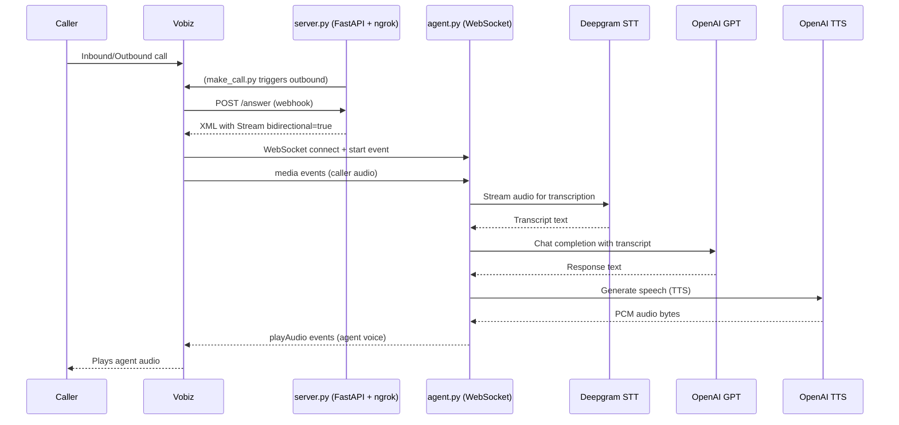

# Vobiz AI Voice Agent — Python Voice API Example

Bridge a live PSTN phone call to a real-time AI voice agent over the Vobiz Voice API, using bidirectional mu-law audio streaming over a WebSocket.

[](./LICENSE)
[](https://www.python.org/)
[](https://docs.vobiz.ai)

---

## Overview

This repository is a complete, runnable Python example of a conversational AI agent
answering a real phone call. `make_call.py` places an outbound call through the Vobiz
REST API. `server.py` answers the resulting Vobiz webhook with XML containing a
bidirectional `<Stream>` element. `agent.py` then runs the call: caller audio arrives as
base64 mu-law frames over a WebSocket, goes to Deepgram for live transcription, the
transcript goes to an OpenAI chat model, and the reply is synthesised with OpenAI TTS
and streamed back into the call as `playAudio` events. If the caller speaks while the
agent is talking, the agent sends `clearAudio` to interrupt its own playback.

The interesting problem this solves is not "call an LLM" — it is the audio plumbing
either side of it. Telephony runs at 8 kHz in G.711 mu-law; TTS models emit 24 kHz
linear PCM. Something has to resample, companded-encode, chunk to 20 ms frames, base64
them, and keep the two directions flowing concurrently without blocking the event loop.
That is the part this example spells out, in about 400 lines of readable Python with no
framework in between.

It is written for developers evaluating Vobiz for AI voice work who want to see the
whole path — REST call origination, XML webhook, WebSocket media protocol, barge-in —
rather than a single snippet. Everything runs locally behind an ngrok tunnel, so you can
place a call to your own mobile and talk to the agent within a few minutes of cloning.

At the end you have a working agent you can point at your own system prompt, your own
LLM, and your own TTS voice, and a clear picture of the Vobiz stream protocol to build
something more substantial on.

## What you can build with it

- **Outbound qualification and callback bots** — dial a lead list from `make_call.py`,
  greet the answerer, qualify with a few LLM-driven questions, and hand off.
- **Inbound receptionists and front-line support** — point a Vobiz Application's Answer
  URL at `/answer` and let the agent triage before a human picks up.
- **Appointment reminders with confirmation** — a short scripted opener followed by
  free-form confirm/reschedule handled in natural language rather than DTMF menus.
- **Voice front-ends to an internal API** — swap `get_llm_response` for a call into your
  own agent or tool-calling loop; the audio layer stays unchanged.
- **Latency and voice-quality benchmarking** — the pipeline is instrumented with logs at
  each stage, so it doubles as a harness for comparing STT, LLM, and TTS vendors.
- **A reference for porting to another stack** — the WebSocket protocol table below is
  language-agnostic; the Python here is the executable specification.

## How it works

A call arrives (or is placed). Vobiz POSTs the Answer URL, and `server.py` replies with
a `<Stream>` element telling Vobiz to open a WebSocket back to `/ws` and to send audio
over it in both directions. `server.py` proxies that socket to `agent.py` on an internal
port, which creates one `CallSession` per call.

The session opens a second WebSocket to Deepgram and forwards every inbound `media`
frame to it untouched — Deepgram is configured for `encoding=mulaw&sample_rate=8000`, so
no conversion is needed on the way in. Deepgram streams back interim and final
transcripts. On each final transcript the session restarts a 1.2 second silence timer;
when that timer expires without a new final result, the accumulated text is treated as a
complete user turn. It is appended to the conversation history, sent to the chat model,
and the reply is synthesised, converted to mu-law, and pushed back as `playAudio` frames
followed by a `checkpoint` marker.



**Protocol stack**

- **Telephony:** SIP/PSTN → Vobiz XML webhooks (`application/x-www-form-urlencoded`)
- **Streaming:** WebSocket (WSS) → JSON frames with base64 audio payloads
- **Transcription:** WebSocket → Deepgram `nova-2`
- **Reasoning:** HTTPS → OpenAI `gpt-4o-mini`
- **Synthesis:** HTTPS → OpenAI `tts-1`, `response_format="pcm"`

**Barge-in.** While the agent is speaking it keeps streaming caller audio to Deepgram.
When a user turn is ready for processing and `is_playing` is still true, the session
sends `clearAudio` before generating the next reply, so Vobiz drops whatever is left in
its playback buffer. Vobiz acknowledges with `clearedAudio`. Playback is also marked
finished when the `playedStream` acknowledgement for the trailing `checkpoint` arrives.

## Architecture

| File | Responsibility |
|------|----------------|
| `make_call.py` | Places an outbound call via `POST /api/v1/Account/{auth_id}/Call/`. Auto-detects the Answer URL from a running `server.py` by reading its `/health` endpoint, or accepts `--to`, `--from`, `--answer-url` on the command line. |
| `server.py` | FastAPI app plus pyngrok tunnel. Serves `/answer`, `/hangup`, `/stream-status`, `/health`, and the `/ws` WebSocket. Starts `agent.py`'s WebSocket server in a daemon thread, opens the tunnel, then runs uvicorn. The single entry point — running this runs everything. |
| `server.py` → `/ws` | WebSocket proxy. Accepts the socket Vobiz opens through the ngrok tunnel and pipes it bidirectionally to the local agent, so one HTTP tunnel serves both webhooks and media. |
| `agent.py` | The call brain. `CallSession` holds per-call state: stream and call IDs, conversation history, playback flag, the Deepgram socket, and the silence timer. Also contains the mu-law encoder and the resampler. |
| `agent.py` → `generate_tts_audio` | Calls OpenAI TTS, resamples 24 kHz → 8 kHz, converts PCM16 → mu-law, returns raw bytes ready to chunk. |
| `agent.py` → `_play_audio` / `_clear_audio` | Frame and emit `playAudio` (160-byte chunks) plus a trailing `checkpoint`; emit `clearAudio` for barge-in. |
| `.env.example` | Template for the credentials and call settings. Copy to `.env`. |
| `requirements.txt` | `fastapi`, `uvicorn[standard]`, `python-multipart`, `websockets`, `deepgram-sdk`, `openai`, `pyngrok`, `python-dotenv`, `requests`. |

## Prerequisites

- **Python 3.11 or newer.** The code uses `X | None` type syntax and `list[dict]`
  generics.
- **A Vobiz account** with an Auth ID and Auth Token, and at least one voice-enabled
  number to use as the caller ID. Sign up at [vobiz.ai](https://vobiz.ai).
- **An OpenAI API key** with access to `gpt-4o-mini` and `tts-1`.
- **A Deepgram API key** with access to the `nova-2` model.
- **An ngrok account and authtoken.** `pyngrok` is installed by `requirements.txt`, but
  the tunnel needs an authtoken — either exported through `NGROK_AUTH_TOKEN` in `.env`
  or configured once globally with `ngrok config add-authtoken <token>`.
- **Outbound HTTPS and WSS** to `api.vobiz.ai`, `api.openai.com`, and
  `api.deepgram.com`, plus inbound access through the tunnel on the HTTP port.

## Setup

1. **Clone and enter the repository.**

   ```bash
   git clone https://github.com/vobiz-ai/Vobiz-Python-Voice-API-Example.git
   cd Vobiz-Python-Voice-API-Example
   ```

2. **Create and activate a virtual environment.**

   ```bash
   python3 -m venv venv
   source venv/bin/activate          # Windows: venv\Scripts\activate
   ```

3. **Install the dependencies.**

   ```bash
   pip install -r requirements.txt
   ```

4. **Create your environment file.**

   ```bash
   cp .env.example .env
   ```

5. **Fill in `.env`.** At minimum set `DEEPGRAM_API_KEY`, `OPENAI_API_KEY`,
   `VOBIZ_AUTH_ID`, `VOBIZ_AUTH_TOKEN`, `FROM_NUMBER`, and `TO_NUMBER`. `FROM_NUMBER`
   must be a number on your Vobiz account; `TO_NUMBER` is the phone you will answer. Use
   E.164 format, for example `+15550003333`. See
   [Configuration](#configuration) for every variable the code reads.

6. **Authenticate ngrok** if you have not already:

   ```bash
   ngrok config add-authtoken <your-ngrok-token>
   ```

   Alternatively add `NGROK_AUTH_TOKEN=<your-ngrok-token>` to `.env` and `server.py`
   will apply it at startup.

7. **Optional — customise the agent.** `AGENT_SYSTEM_PROMPT` sets the persona and
   `OPENAI_TTS_VOICE` picks the voice. Both are read at import time, so restart
   `server.py` after changing them.

## Configuration

Every variable below is read directly from the source. Anything not listed here has no
effect.

| Variable | Required | Default | Description |
|----------|----------|---------|-------------|
| `DEEPGRAM_API_KEY` | Yes | — | Deepgram key, sent to the live transcription socket as `Authorization: Token <key>`. Read by `agent.py`. |
| `OPENAI_API_KEY` | Yes | — | OpenAI key used for both the chat completion and the TTS request. Read by `agent.py`. |
| `VOBIZ_AUTH_ID` | Yes (to place calls) | — | Vobiz Auth ID. Used both in the request path and as the `X-Auth-ID` header. Read by `make_call.py`. |
| `VOBIZ_AUTH_TOKEN` | Yes (to place calls) | — | Vobiz Auth Token, sent as the `X-Auth-Token` header. Read by `make_call.py`. |
| `FROM_NUMBER` | Yes (to place calls) | — | Caller ID in E.164. Must be a voice-enabled number on your Vobiz account. Overridable with `--from`. |
| `TO_NUMBER` | Yes (to place calls) | — | Destination number in E.164. Overridable with `--to`. |
| `AGENT_SYSTEM_PROMPT` | No | `You are a helpful AI phone assistant. Be concise and conversational. Keep responses under 2 sentences.` | System message seeded into every `CallSession`'s conversation history. |
| `OPENAI_TTS_VOICE` | No | `alloy` | OpenAI TTS voice: `alloy`, `echo`, `fable`, `onyx`, `nova`, or `shimmer`. |
| `HTTP_PORT` | No | `5000` | Port uvicorn binds and ngrok tunnels. Note that `make_call.py`'s auto-detection always probes `http://127.0.0.1:5000/health`, so if you change this, pass `--answer-url` explicitly. |
| `AGENT_WS_PORT` | No | `5001` | Internal port for the agent WebSocket server. Read by both `server.py` (proxy target) and `agent.py` (bind address). Not exposed through the tunnel. |
| `NGROK_AUTH_TOKEN` | No | empty | ngrok authtoken. If set, applied to the pyngrok default config at startup; otherwise pyngrok uses whatever `ngrok config` already holds. |

`HTTP_PORT`, `AGENT_WS_PORT`, and `NGROK_AUTH_TOKEN` are not in `.env.example` — add
them only if you need to change the defaults.

## Running it

**Terminal 1 — start the server, tunnel, and agent:**

```bash
source venv/bin/activate
python server.py
```

You should see, in order: the agent WebSocket server binding on port 5001, the ngrok
banner printing your public HTTPS URL along with the derived Answer and Hangup URLs, and
uvicorn listening on port 5000. Leave this running.

**Terminal 2 — place the call:**

```bash
source venv/bin/activate
python make_call.py
```

It probes the local `/health` endpoint, prints `Auto-detected Answer URL from running
server: https://<subdomain>.ngrok-free.app/answer`, POSTs to Vobiz, and prints the
returned call UUID. Override the defaults with flags when you need to:

```bash
python make_call.py --to +15550003333 --from +15550003333
python make_call.py --answer-url https://your-domain.example/answer
```

**What you should observe.** Your phone rings. On answer, terminal 1 logs the `/answer`
webhook with the CallUUID, From, To, and Direction, then the Stream XML it returned,
then the WebSocket acceptance and the `start` event with the stream and call IDs.
Deepgram connects, the greeting is synthesised (`TTS audio generated: N bytes of
mulaw`), and you hear it. As you speak, `[STT Final]` lines appear; 1.2 seconds after
you stop, the LLM response is logged and played back. Hanging up produces the `stop`
event, `Session cleaned up`, and a `POST /hangup` log line with the duration and hangup
cause.

**Running the agent alone.** `python agent.py` starts just the WebSocket server on
`AGENT_WS_PORT` without the tunnel or webhooks — useful when you already have another
component terminating the Vobiz stream.

**Inbound calls.** Set the Answer URL of a Vobiz Application to the tunnel's
`/answer` and assign it to one of your numbers. The same code path handles both
directions; `make_call.py` is only needed for outbound.

## Audio pipeline and sample-rate math

The audio conversion is the part most easily got wrong, so it is worth being explicit
about the numbers.

**The telephony side is fixed.** The `<Stream>` element declares
`contentType="audio/x-mulaw;rate=8000"`, which means G.711 mu-law, 8000 samples per
second, mono, one byte per sample. That gives a media rate of exactly:

```
8000 samples/s x 1 byte/sample = 8000 bytes/s = 8 bytes/ms
```

**Why 160-byte chunks are 20 ms.** `_play_audio` uses `chunk_size = 160`. At 8 bytes per
millisecond, 160 bytes is 20 ms of audio — the standard RTP packetisation interval for
G.711. One second of agent speech is therefore 8000 bytes sent as 50 `playAudio` frames.
Sending larger chunks is possible but coarsens the granularity at which `clearAudio` can
cut playback; sending smaller ones multiplies WebSocket and base64 overhead for no gain.

**Why mu-law rather than linear PCM.** Mu-law is a companding codec: it maps a roughly
14-bit linear dynamic range onto 8 bits using a logarithmic curve, allocating finer
resolution to the low amplitudes where speech energy mostly lives. The result is
telephone-quality speech at half the bytes of 16-bit linear PCM at the same sample rate,
which is why the entire PSTN runs on it.

**The mu-law encoder.** `_linear_to_mulaw` implements the standard G.711 algorithm on
one 16-bit signed sample:

1. Take the sign bit off and work with the magnitude.
2. Add a bias of `33` and clamp to `MULAW_MAX = 0x1FFF`. The bias guarantees a non-zero
   value so the exponent search always terminates sensibly.
3. Find the exponent by locating the highest set bit, scanning the thresholds `0x4000`
   down to `0x0100`.
4. Extract a 4-bit mantissa with `(sample >> (exponent + 3)) & 0x0F`.
5. Pack as `sign | (exponent << 4) | mantissa` and bitwise-invert — mu-law is stored
   complemented, which is why silence encodes as `0xFF` rather than `0x00`.

`pcm16_to_mulaw` unpacks the PCM buffer as little-endian signed shorts and runs that
per sample.

**The resampling step.** OpenAI TTS with `response_format="pcm"` returns raw 16-bit
little-endian PCM at 24 kHz — 48,000 bytes per second. Vobiz needs 8 kHz, so
`resample_linear(pcm_24k, 24000, 8000)` reduces it by a ratio of exactly 3. The function
walks the output index, computes the fractional source position, and interpolates
linearly between neighbouring samples. Because 24000/8000 is an integer ratio the
fractional part is always zero here, so in this specific path it reduces to taking every
third sample; the interpolation branch matters if you point it at a source rate that is
not a clean multiple.

There is no anti-aliasing low-pass filter before the decimation. Content above the 4 kHz
Nyquist limit of the 8 kHz output folds back into the audible band, which is the usual
cause of a slightly harsh or metallic edge on sibilants. It is perfectly intelligible
over a phone line, and adding a proper filter is on the roadmap below.

**End-to-end byte budget for one reply.**

```
OpenAI TTS   24 kHz, 16-bit mono   = 48,000 bytes/s
resample     8 kHz,  16-bit mono   = 16,000 bytes/s   (3:1 decimation)
mu-law       8 kHz,  8-bit  mono   =  8,000 bytes/s   (2:1 companding)
framed       160 bytes per event   =     50 events/s
base64       payload grows ~4/3    = ~10,700 bytes/s on the wire
```

**The inbound direction needs no conversion.** The Deepgram socket is opened with
`encoding=mulaw&sample_rate=8000&channels=1`, matching the stream exactly, so each
`media` payload is base64-decoded and forwarded as-is. The rest of the query string
tunes turn-taking: `model=nova-2`, `language=en`, `interim_results=true`,
`utterance_end_ms=1000`, `vad_events=true`, and `endpointing=300`.

## Protocol reference

### HTTP endpoints served by `server.py`

| Method | Path | Purpose |
|--------|------|---------|
| `POST` | `/answer` | Vobiz Answer URL. Reads the form fields, logs them, and returns the `<Stream>` XML. |
| `POST` | `/hangup` | Vobiz Hangup URL. Logs `CallUUID`, `Duration`, `HangupCause`; returns `OK`. |
| `POST` | `/stream-status` | Target of the stream's `statusCallbackUrl`. Logs `Event`, `StreamID`, `CallUUID`; returns `OK`. |
| `GET` | `/health` | Returns `{"status": "healthy", "ngrok_url": "..."}`. This is what `make_call.py` reads to discover the Answer URL. |
| `WS` | `/ws` | Media socket. Accepted, then proxied to the agent on `AGENT_WS_PORT`. |

Vobiz posts webhooks as `application/x-www-form-urlencoded`, which is why
`python-multipart` is a dependency.

**Fields read from `POST /answer`:** `CallUUID`, `From`, `To`, `Direction`.
**Fields read from `POST /hangup`:** `CallUUID`, `Duration`, `HangupCause`.
**Fields read from `POST /stream-status`:** `Event`, `StreamID`, `CallUUID`.

### Answer XML

```xml
<?xml version="1.0" encoding="UTF-8"?>
<Response>
    <Stream bidirectional="true"
            keepCallAlive="true"
            contentType="audio/x-mulaw;rate=8000"
            statusCallbackUrl="https://your-tunnel.ngrok-free.app/stream-status"
            statusCallbackMethod="POST">
        wss://your-tunnel.ngrok-free.app/ws
    </Stream>
</Response>
```

| Attribute | Value used | Meaning |
|-----------|-----------|---------|
| `bidirectional` | `true` | Vobiz both sends caller audio and accepts `playAudio` back on the same socket. |
| `keepCallAlive` | `true` | The call stays up when the stream ends rather than dropping immediately. |
| `contentType` | `audio/x-mulaw;rate=8000` | Codec and sample rate for both directions. |
| `statusCallbackUrl` | `<tunnel>/stream-status` | Where stream lifecycle events are POSTed. |
| `statusCallbackMethod` | `POST` | HTTP method for the status callback. |

The element's text content is the WebSocket URL. `server.py` derives it by rewriting the
ngrok HTTPS URL to `wss://` and appending `/ws`.

### WebSocket events

All frames are JSON text. Audio payloads are base64-encoded mu-law bytes.

**Received from Vobiz — handled in `CallSession.handle_message`:**

| Event | Fields read | Agent behaviour |
|-------|-------------|-----------------|
| `start` | `streamId`, `callId` | Stores the IDs, opens the Deepgram socket, synthesises and plays the greeting. |
| `media` | `media.payload` | Base64-decodes and forwards the bytes straight to Deepgram. |
| `playedStream` | `name` | Checkpoint reached — the audio before that marker finished playing. Sets `is_playing = False`. |
| `clearedAudio` | — | Acknowledges a `clearAudio`. Sets `is_playing = False`. |
| `stop` | — | Stream ended. Runs `cleanup()`: closes Deepgram, cancels the listener task and silence timer. |

**Sent to Vobiz:**

| Event | Fields sent | Purpose |
|-------|-------------|---------|
| `playAudio` | `media.contentType`, `media.sampleRate`, `media.payload` | One 20 ms mu-law chunk of agent speech. |
| `checkpoint` | `streamId`, `name` | Marker appended after a reply; Vobiz answers with `playedStream` once the preceding audio has been heard. |
| `clearAudio` | `streamId` | Barge-in. Drops everything queued for playback. |

```json
{
  "event": "playAudio",
  "media": {
    "contentType": "audio/x-mulaw",
    "sampleRate": 8000,
    "payload": "f39/f39/f39/..."
  }
}
```

```json
{
  "event": "clearAudio",
  "streamId": "s-123"
}
```

```json
{
  "event": "checkpoint",
  "streamId": "s-123",
  "name": "response-4"
}
```

### Vobiz REST call origination

`make_call.py` POSTs to `https://api.vobiz.ai/api/v1/Account/{VOBIZ_AUTH_ID}/Call/`
with headers `Content-Type: application/json`, `X-Auth-ID`, and `X-Auth-Token`:

```json
{
  "from": "+15550003333",
  "to": "+15550003333",
  "answer_url": "https://your-tunnel.ngrok-free.app/answer",
  "answer_method": "POST",
  "hangup_url": "https://your-tunnel.ngrok-free.app/hangup",
  "hangup_method": "POST"
}
```

The hangup URL is derived from the answer URL by substring replacement, so a custom
`--answer-url` should end in `/answer` for the pairing to work. The response is read for
`request_uuid`, falling back to `call_uuid`.

Full API details: [docs.vobiz.ai/api-reference](https://docs.vobiz.ai/api-reference).

## Troubleshooting

| Symptom | Likely cause | Fix |
|---------|--------------|-----|
| `Form data requires "python-multipart" to be installed` on the first webhook | FastAPI cannot parse the form-encoded body Vobiz sends without it | `pip install python-multipart`, or reinstall from `requirements.txt` |
| `Failed to setup ngrok` at startup, then exit | pyngrok has no authtoken, or another ngrok agent is already running | `ngrok config add-authtoken <token>`, or set `NGROK_AUTH_TOKEN` in `.env`; kill any stray `ngrok` process |
| `AttributeError: 'NoneType' object has no attribute 'replace'` inside `/answer` | `NGROK_URL` is still `None` — the tunnel failed to open, so the handler cannot build the WSS URL | Fix the tunnel first; the ngrok banner must appear in the log before any call is placed |
| `Could not connect to server.py at http://127.0.0.1:5000` from `make_call.py` | `server.py` is not running, or `HTTP_PORT` was changed (auto-detection always probes 5000) | Start `server.py` first, or pass `--answer-url https://<tunnel>/answer` explicitly |
| Call connects but is silent | `generate_tts_audio` returned empty bytes — look for `OpenAI TTS error` or `OpenAI TTS returned empty audio` in the log | Check `OPENAI_API_KEY`, model access to `tts-1`, and outbound HTTPS to `api.openai.com` |
| `Deepgram connection error` and no `[STT Final]` lines ever appear | Invalid `DEEPGRAM_API_KEY`, no access to `nova-2`, or a `websockets` version older than the one that accepts `additional_headers` | Verify the key, then `pip install -U websockets` |
| Agent replies but never hears you; only `media` events in the log | Audio is reaching the agent but not Deepgram — the socket closed and `send_audio_to_deepgram` logged `Deepgram WebSocket already closed` | Restart the call; check for network interruption to `api.deepgram.com` |
| Noticeable pause before every reply | The 1.2 s silence timer in `_process_after_silence` plus full TTS synthesis before the first chunk is sent | Lower the `asyncio.sleep(1.2)` value and/or `utterance_end_ms` and `endpointing` in `DEEPGRAM_WS_URL` |
| Agent talks over you instead of stopping | Barge-in fires when a user turn is processed, not on the first syllable, so a very short interjection during a long reply may not cut it off | Shorten replies via `AGENT_SYSTEM_PROMPT`, or move the `_clear_audio()` call to trigger on the first interim transcript |
| `'ClientConnection' object has no attribute 'open'` | Older code checking `.open` against a newer `websockets` release | Already handled here — the code uses try/except around sends rather than probing connection state |
| Caller hears the greeting twice | Two `start` events, usually from a duplicate `<Stream>` or a stale process still bound to `AGENT_WS_PORT` | Ensure only one `server.py` is running: `lsof -i :5000 -i :5001` |

## Security notes

- **Three sets of credentials sit in `.env`:** the Vobiz Auth ID and Token, the OpenAI
  key, and the Deepgram key. `.gitignore` already excludes `.env` and `.env.*` while
  keeping `.env.example` — verify with `git check-ignore -v .env` before your first
  commit. Use separate keys for this example and rotate them if the tunnel URL was ever
  shared.
- **The ngrok tunnel is publicly reachable.** Anyone who learns the URL can POST to
  `/answer`, `/hangup`, and `/stream-status`, or open `/ws` and drive the agent — which
  consumes your OpenAI and Deepgram quota. The tunnel is unauthenticated by design for
  local development. Stop `server.py` when you are not testing, and treat the URL as a
  secret while it is up.
- **These webhooks are not signature-verified.** The handlers trust the form fields they
  receive. Before running anything like this outside a development machine, add
  verification of the request's origin and reject calls whose `CallUUID` you did not
  originate.
- **Live call audio leaves your infrastructure.** Every inbound frame is streamed to
  Deepgram and every reply is synthesised by OpenAI, so both sides of the conversation
  transit third-party services. If callers may disclose personal, health, or payment
  data, confirm your data-processing agreements with those vendors, check their data
  retention settings, and disclose the recording and processing to callers where your
  jurisdiction requires it.
- **Conversation history is held in memory only.** `CallSession.conversation_history`
  lives for the duration of the call and is discarded on `stop` — nothing is written to
  disk. If you add persistence, that store becomes PII and needs the corresponding
  controls.
- **Logs contain metadata, not audio.** The default log level prints phone numbers, call
  UUIDs, and full transcripts at INFO. Reduce the level or redact before shipping logs
  anywhere shared.

## Roadmap

> Planned improvements to this example. Ideas and pull requests are welcome —
> open an issue to discuss anything here.

- [ ] Replace the naive decimation in `resample_linear` with a proper polyphase or
      windowed-sinc filter, including an anti-aliasing low-pass before the 24 kHz → 8 kHz
      step, to remove the aliasing on sibilants.
- [ ] Stream TTS audio incrementally instead of synthesising the whole reply before the
      first `playAudio` frame is sent, so time-to-first-audio drops to roughly one
      sentence rather than the full response.
- [ ] Reconnect automatically when the Deepgram socket drops mid-call, rather than
      leaving the session deaf for the rest of the conversation.
- [ ] Persist conversation history and call metadata to a store, so a caller who rings
      back is recognised and transcripts survive the process.
- [ ] Add a test suite: unit tests for `pcm16_to_mulaw` and `resample_linear` against
      reference G.711 vectors, plus a fake Vobiz WebSocket client that drives a full
      `start` → `media` → `stop` session.
- [ ] Document a deployment path beyond the ngrok tunnel — a container image, a stable
      public hostname, and TLS termination — so the example can run somewhere other than
      a laptop.
- [ ] Trigger barge-in from the first interim transcript rather than at turn processing,
      and add metrics for per-stage latency (STT final, LLM, TTS, first audio out).

## Contributing

Issues and pull requests are welcome. If you hit something that does not match what is
documented here, open an issue with the relevant log lines — the INFO-level output
identifies which stage failed.

Before opening a pull request:

- Run the full loop end to end (`python server.py`, then `python make_call.py`) and
  confirm the greeting plays and a reply comes back.
- Keep changes grounded in what the code actually does; this README is meant to stay
  verifiable against the source.
- Redact phone numbers, call UUIDs, and API keys from anything you paste into an issue
  or a commit.

## License

Released under the [MIT License](./LICENSE) © Vobiz.

MIT is permissive: you may use, modify, and redistribute this code, including in
closed-source commercial products, provided the copyright notice and licence text
are retained. There is no warranty. If your organisation needs a different
licensing arrangement, contact [piyush@vobiz.ai](mailto:piyush@vobiz.ai).

## Built by Team Vobiz

[Vobiz](https://vobiz.ai) is a programmable voice and SIP-trunking platform for
voice APIs, SIP trunking, and AI voice agents. This repository is built and
maintained by the Vobiz team.

**Maintainer:** Piyush Sahoo — [piyush@vobiz.ai](mailto:piyush@vobiz.ai) · [LinkedIn](https://www.linkedin.com/in/piyush-s713/)

Questions, or want to talk through an integration? Open an issue on this repo,
or reach out directly at [piyush@vobiz.ai](mailto:piyush@vobiz.ai).

**Useful links:** [Docs](https://docs.vobiz.ai) · [API reference](https://docs.vobiz.ai/api-reference) · [Sign up](https://vobiz.ai)
